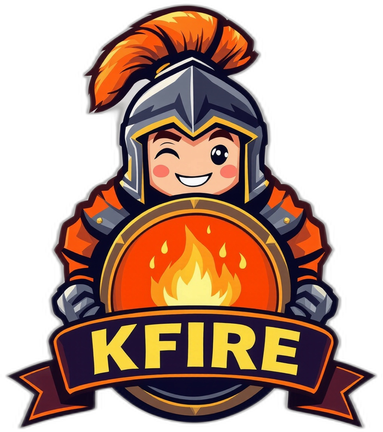

<p align="center">
  
</p>

<h1 align="center">kfire-client</h1>

<p align="center">
  The KFIRE desktop app — lives in your tray, detects your games, shares your presence.
</p>

<p align="center">
  <a href="./LICENSE"></a>
  
  
  <a href="https://github.com/knightsofeternity/kfire-client/releases/latest"></a>
  <a href="https://github.com/knightsofeternity/kfire-client/actions/workflows/release.yml"></a>
</p>

---

Desktop client for **KFIRE** (Knight FIRE), an open-source self-hosted gaming presence
tracker inspired by Xfire. The client runs in your system tray, detects which game you're
playing, and reports it to your organization's [kfire-server](https://github.com/knightsofeternity/kfire-server).

## Download

Grab the installer for your platform from the
[**latest release**](https://github.com/knightsofeternity/kfire-client/releases/latest)
— or, even simpler, from the **Get the app** page on your organization's KFIRE server.

| Platform | File |
|----------|------|
| Windows  | `.msi` / `.exe` |
| macOS    | `.dmg` (Apple Silicon & Intel) |
| Linux    | `.AppImage` / `.deb` |

## First launch — no password needed

1. Open the app and enter your organization's **server address** (e.g. `https://kfire.example.org`).
2. The app opens your **browser** to confirm — you approve the device there (you're already signed in).
3. Done. The app links itself and lives in your tray. 🛡️🔥

This is the OAuth **device-grant** flow (like Discord / the GitHub CLI): your password is
never typed into the desktop app, and the link is bound to this specific device.

## What it does

- Runs in the **system tray**, lightweight
- Scans local processes every 5 s ([`sysinfo`](https://crates.io/crates/sysinfo)) and
  matches them against the catalog downloaded from the server (cached in SQLite)
- Pushes `game_started` / `game_stopped` over WebSocket, with heartbeat,
  exponential-backoff reconnection and an **offline queue** (events made while offline are
  flushed on reconnect)

## Stack

[Tauri 2](https://tauri.app) (Rust) + [Svelte 5](https://svelte.dev).

```
src/                      Svelte UI (link flow, status, detected games)
src-tauri/src/lib.rs      app wiring: state, commands, tray, device linking
src-tauri/src/api.rs      REST client (pairing, refresh, games)
src-tauri/src/db.rs       SQLite cache (settings, catalog, offline queue)
src-tauri/src/scanner.rs  process scan loop (exe → game)
src-tauri/src/ws.rs       WebSocket task (hello, heartbeat, backoff, drain)
```

## Development

Prerequisites: [Rust](https://rustup.rs), Node ≥ 22, pnpm, and the
[Tauri Linux deps](https://tauri.app/start/prerequisites/#linux) on Ubuntu.

```bash
pnpm install
pnpm tauri dev      # run with hot reload
pnpm tauri build    # local production bundle
```

Releases are built automatically for Windows/macOS/Linux by GitHub Actions when a `v*` tag
is pushed (see [`.github/workflows/release.yml`](./.github/workflows/release.yml)).

## Related repositories

- [kfire-server](https://github.com/knightsofeternity/kfire-server) — backend + admin web UI (AGPL-3.0)
- [kfire-protocol](https://github.com/knightsofeternity/kfire-protocol) — API & WebSocket contract (Apache-2.0)

## License

[MIT](./LICENSE)
